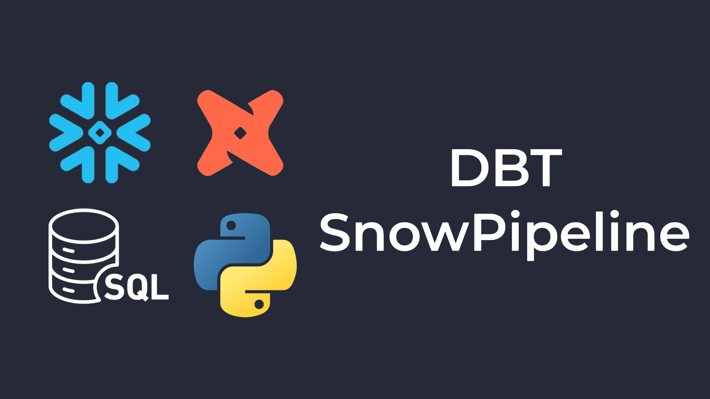

## **English**

---
This project is responsible for transforming and modeling a dataset using dbt (Data Build Tool)and Snowflake.
## **Español**

---
Este proyecto se encarga de transformar y modelar un DataSet utilizando dbt (Data Build Tool) y Snowflake.

# Cómo Funciona ⚙️
--- 
1. *Carga de Datos:*  
   Se carga el dataset original en Snowflake, lo que genera una tabla base (por ejemplo, yo lo nombré DATASET_SUPERSTORE).

2. *Transformación de los datos con dbt:*  
   Usé dbt para transformar, limpiar y modelar los datos. Cada modelo se encuentra en la carpeta models/ y los resultados se muestran en Snowflake como views o tablas, según lo que definas en dbt_project.yml. En mi caso, la view *sales* contiene los datos transformados listos para el análisis.

3. *Validación y Calidad de Datos:*  
   Se ejecutan tests automatizados para asegurar la calidad y consistencia de los datos.
   
5. *Consumo de Datos:*  
   Los datos transformados están disponibles para ser consumidos por herramientas de análisis y visualizacion de datos (como Power BI, Tableau, o directamente mediante consultas en Snowflake) para obtener insights de los mismos.

# Servicios, Herramientas, etc ☁️💾

- *dbt Core:* Para definir y ejecutar transformaciones en SQL.  
- *Snowflake:* Como data warehouse para almacenar los datos transformados.  
- *Python & Entorno Virtual:* Para administrar dbt y sus dependencias sin conflictos en el sistema.

